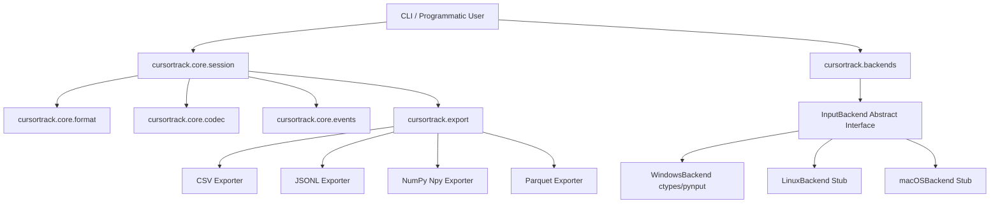

# Architecture and Design

This document details the modular system architecture of CursorTrack and its boundaries.

---

## 1. System Block Diagram

---

## 2. Package Boundaries

### `cursortrack/cli/`
The command-line parsing layer. It uses **Typer** and **Rich** to provide user interaction, terminal formatting, status updates, and progress bars. The CLI files are thin wrappers calling underlying library logic in `core/` and `export/`.

### `cursortrack/core/`
The programmatic core library.
- [format.py](../cursortrack/core/format.py) handles packing and unpacking file headers.
- [codec.py](../cursortrack/core/codec.py) manages raw integer encodings (varint/zigzag) and streaming compression writers.
- [events.py](../cursortrack/core/events.py) defines the structured dataclass hierarchy for input events (`MoveEvent`, `ButtonEvent`, etc.) and handles tag serialization.
- [session.py](../cursortrack/core/session.py) exposes the primary developer API `Session` for programmatically loading, editing, saving, and analyzing tracks (e.g. converting to Pandas DataFrames).

### `cursortrack/backends/`
Encapsulates OS-specific interaction. Subclasses of `InputBackend` implement coordinates retrieval, mouse warping, and hardware click/scroll hooks. Calling code handles these actions through the abstraction, making platform support entirely additive.

### `cursortrack/export/`
Translates parsed `Session` events into analytical standard formats. It handles CSV, JSON Lines, NumPy binary files, and optionally Parquet tables.

---

## 3. Playback Fail-Safe Architecture

To prevent simulated replays from capturing display focus and locking out human control, CursorTrack intercepts physical movement:
- During playback, before setting each virtual cursor position, the script queries the physical hardware cursor position using `backend.read_position()`.
- If the current cursor coordinate deviates from the expected coordinates and sits within 5 pixels of any monitor screen corner, a fail-safe trigger aborts execution immediately.

---

## 4. Touchpad Gesture Capture Limitations

`WindowsBackend.start_listening()` captures clicks and scroll through a single `pynput.mouse.Listener`, which under the hood is a low-level Win32 mouse hook (`WH_MOUSE_LL`). That hook only sees the same message types any Windows app can see: `WM_LBUTTONDOWN/UP` (and other buttons), `WM_MOUSEWHEEL`, `WM_MOUSEHWHEEL`. This has two real consequences for touchpad input, one unfixable and one that's a known, deliberately-deferred gap:

**Multi-finger gestures (pinch, rotate, 3/4-finger swipes) — architecturally unfixable.** Windows never turns these into mouse messages at all; it consumes them internally for shell-level gestures (Task View, virtual desktop switching). The only API surface that exposes multi-finger gesture data is `Windows.UI.Input.GestureRecognizer` (WinRT), and it's scoped to a window that currently holds pointer focus — it cannot be subscribed to system-wide from a background process. There is no lower-level fallback for this one; it is a genuine ceiling of what a background recorder can do on Windows.

**Two-finger scroll — sometimes invisible, but not for the same reason.** Two-finger scroll *is* just two touch contacts moving together, and in principle it's a much simpler gesture than the ones above. Whether `CAP_SCROLL` sees it depends entirely on how a given touchpad's Precision Touchpad (PTP) driver chooses to deliver it:
- Some drivers synthesize a classic `WM_MOUSEWHEEL`/`WM_MOUSEHWHEEL` message for compatibility — `pynput`'s hook (and thus CursorTrack) sees this fine.
- Others deliver it through a modern pointer/gesture channel (`WM_POINTER`-based smooth/inertial scrolling or DirectManipulation) that bypasses `WM_MOUSEWHEEL` entirely. On these drivers, **no** low-level hook can see it as a scroll event — this was confirmed by direct testing: both `pynput` and a raw `ctypes`-based `WH_MOUSE_LL` hook (bypassing `pynput` entirely) captured zero wheel messages during two-finger scrolling, even though the OS was visibly scrolling window content correctly and the touchpad's "two-finger scrolling" setting was enabled. Physical/USB mouse wheel scrolling is unaffected either way, since a real scroll wheel always generates the classic message.

**The real fix, and why it's deferred.** Two-finger scroll's raw signal — two touch contacts — is still available via the Raw Input API (`RegisterRawInputDevices` with the Digitizer/Touch-Pad HID usage), which bypasses Windows' gesture-interpretation layer and can run from a background message-only window (no visible/focused UI required, unlike `GestureRecognizer`). Building this requires: a hidden message-only window + Win32 message pump on a background thread, HID report parsing (`hid.dll`'s `HidP_*` functions) to extract per-contact position/count, and a hand-rolled "2 contacts moving together vertically" gesture recognizer on top. This was deliberately not built for v0.1 because:
- Precision Touchpad HID report layouts are only loosely standardized across vendors (Synaptics/Elan/etc. have shipped nonstandard variants), so behavior validated on one laptop isn't guaranteed to hold on another.
- It cannot be exercised by CI at all — GitHub Actions Windows runners have no touchpad hardware, so this subsystem would have zero automated regression coverage, unlike everything else in this codebase.

Contributions implementing raw digitizer capture are welcome; see [CONTRIBUTING.md](../CONTRIBUTING.md).
