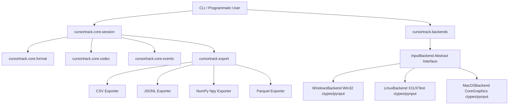

# Architecture and Design

This document details the modular system architecture of CursorTrack and its boundaries.

---

## 1. System Block Diagram

---

## 2. Package Boundaries

### `cursortrack/cli/`
The command-line parsing layer. It uses **Typer** and **Rich** to provide user interaction, terminal formatting, status updates, and progress bars. The CLI files are thin wrappers calling underlying library logic in `core/` and `export/`.

### `cursortrack/core/`
The programmatic core library.
- [format.py](../cursortrack/core/format.py) handles packing and unpacking file headers.
- [codec.py](../cursortrack/core/codec.py) manages raw integer encodings (varint/zigzag) and streaming compression writers.
- [events.py](../cursortrack/core/events.py) defines the structured dataclass hierarchy for input events (`MoveEvent`, `ButtonEvent`, etc.) and handles tag serialization.
- [session.py](../cursortrack/core/session.py) exposes the primary developer API `Session` for programmatically loading, editing, saving, and analyzing tracks (e.g. converting to Pandas DataFrames).

### `cursortrack/backends/`
Encapsulates OS-specific interaction. Subclasses of `InputBackend` implement coordinates retrieval, mouse warping, and hardware click/scroll hooks. Calling code handles these actions through the abstraction, making platform support entirely additive.

### `cursortrack/export/`
Translates parsed `Session` events into analytical standard formats. It handles CSV, JSON Lines, NumPy binary files, and optionally Parquet tables.

---

## 3. Playback Fail-Safe Architecture

To prevent simulated replays from capturing display focus and locking out human control, CursorTrack intercepts physical movement:
- During playback, before setting each virtual cursor position, the script queries the physical hardware cursor position using `backend.read_position()`.
- If the current cursor coordinate deviates from the expected coordinates and sits within 5 pixels of any monitor screen corner, a fail-safe trigger aborts execution immediately.

---

## 4. Touchpad Gesture Capture Limitations

`WindowsBackend.start_listening()` captures clicks and scroll through a single `pynput.mouse.Listener`, which under the hood is a low-level Win32 mouse hook (`WH_MOUSE_LL`). That hook only sees the same message types any Windows app can see: `WM_LBUTTONDOWN/UP` (and other buttons), `WM_MOUSEWHEEL`, `WM_MOUSEHWHEEL`. This has two real consequences for touchpad input, one unfixable and one that's a known, deliberately-deferred gap:

**Multi-finger gestures (pinch, rotate, 3/4-finger swipes) — architecturally unfixable.** Windows never turns these into mouse messages at all; it consumes them internally for shell-level gestures (Task View, virtual desktop switching). The only API surface that exposes multi-finger gesture data is `Windows.UI.Input.GestureRecognizer` (WinRT), and it's scoped to a window that currently holds pointer focus — it cannot be subscribed to system-wide from a background process. There is no lower-level fallback for this one; it is a genuine ceiling of what a background recorder can do on Windows.

**Two-finger scroll — sometimes invisible, but not for the same reason.** Two-finger scroll *is* just two touch contacts moving together, and in principle it's a much simpler gesture than the ones above. Whether `CAP_SCROLL` sees it depends entirely on how a given touchpad's Precision Touchpad (PTP) driver chooses to deliver it:
- Some drivers synthesize a classic `WM_MOUSEWHEEL`/`WM_MOUSEHWHEEL` message for compatibility — `pynput`'s hook (and thus CursorTrack) sees this fine.
- Others deliver it through a modern pointer/gesture channel (`WM_POINTER`-based smooth/inertial scrolling or DirectManipulation) that bypasses `WM_MOUSEWHEEL` entirely. On these drivers, **no** low-level hook can see it as a scroll event — this was confirmed by direct testing: both `pynput` and a raw `ctypes`-based `WH_MOUSE_LL` hook (bypassing `pynput` entirely) captured zero wheel messages during two-finger scrolling, even though the OS was visibly scrolling window content correctly and the touchpad's "two-finger scrolling" setting was enabled. Physical/USB mouse wheel scrolling is unaffected either way, since a real scroll wheel always generates the classic message.

**The real fix, and why it's deferred.** Two-finger scroll's raw signal — two touch contacts — is still available via the Raw Input API (`RegisterRawInputDevices` with the Digitizer/Touch-Pad HID usage), which bypasses Windows' gesture-interpretation layer and can run from a background message-only window (no visible/focused UI required, unlike `GestureRecognizer`). Building this requires: a hidden message-only window + Win32 message pump on a background thread, HID report parsing (`hid.dll`'s `HidP_*` functions) to extract per-contact position/count, and a hand-rolled "2 contacts moving together vertically" gesture recognizer on top. This was deliberately not built for v0.1 because:
- Precision Touchpad HID report layouts are only loosely standardized across vendors (Synaptics/Elan/etc. have shipped nonstandard variants), so behavior validated on one laptop isn't guaranteed to hold on another.
- It cannot be exercised by CI at all — GitHub Actions Windows runners have no touchpad hardware, so this subsystem would have zero automated regression coverage, unlike everything else in this codebase.

Contributions implementing raw digitizer capture are welcome; see [CONTRIBUTING.md](../CONTRIBUTING.md).

---

## 5. Linux (X11/Wayland) Notes

`LinuxBackend` mirrors the Windows backend's dependency-free design: it drives the X server directly through `ctypes` against `libX11`/`libXtst` (no Python packages needed for playback or position sampling), and reuses `pynput` for global click/scroll capture hooks.

**How each operation maps to X11:**
- `read_position()` → `XQueryPointer` on the root window.
- `set_position(x, y)` → `XWarpPointer` to root-window coordinates.
- `get_screen_size()` → `XDisplayWidth`/`XDisplayHeight` of the default screen.
- `click(button, pressed)` → `XTestFakeButtonEvent` (X buttons 1/2/3 for left/middle/right, 8/9 for x1/x2).
- `scroll(sdx, sdy)` → the X11 core protocol has no scroll-delta events; each wheel step is a press+release of buttons 4-7 (up/down/left/right).

**Why every injection is followed by `XSync`, not `XFlush`.** Xlib buffers protocol requests per connection. Flushing the buffer alone was observed (under Xvfb, with a `pynput` hook listening on a second connection) to leave `XTestFakeButtonEvent` requests undelivered to other clients' event hooks, while a full server round-trip (`XSync`) delivers them reliably. `pynput`'s own Linux controller syncs after every injection for the same reason. The cost is one round-trip per injected event, which is negligible against the recorder's sampling intervals.

**Threading.** `XInitThreads` is called before any other Xlib call so a single backend's display connection is safe to touch from both the recorder's sampling loop and the playback fail-safe polling.

**Wayland scope.** On Wayland desktops, CursorTrack connects to the XWayland compatibility server. Position reads, warps, and injected clicks work within the XWayland coordinate space, and capture hooks see events routed to X11 clients. What is *not* possible — for any unprivileged process, by compositor design — is globally capturing input delivered to native Wayland clients or injecting input into them. First-class native Wayland support would require the `org.freedesktop.portal.RemoteDesktop` portal (interactive permission prompts) or raw `/dev/input` access (root/`input` group); both are tracked in [ROADMAP.md](../ROADMAP.md).

---

## 6. macOS (CoreGraphics) Notes

`MacOSBackend` mirrors the Linux/Windows backends' dependency-free design: it drives the OS directly through `ctypes` against `CoreGraphics`, `CoreFoundation`, and `ApplicationServices` (no `pyobjc` needed for emulation or position reads), and reuses `pynput` for global click/scroll capture hooks. `pynput` itself pulls in `pyobjc` transitively on macOS to implement that capture hook — this is unavoidable, since macOS event taps are only exposed through Objective-C-bridged APIs (`Quartz.CGEventTapCreate` et al.), unlike X11/Win32 which have plain C entry points.

**How each operation maps to CoreGraphics:**
- `read_position()` → `CGEventCreate(NULL)` + `CGEventGetLocation`, then `CFRelease` the throwaway event.
- `set_position(x, y)` → `CGEventCreateMouseEvent(..., kCGEventMouseMoved, ...)` + `CGEventPost(kCGHIDEventTap, ...)`. This posts a move event rather than calling `CGWarpMouseCursorPosition`, so other applications observe the motion the same way they would a real mouse move — matching `XWarpPointer`/`SetCursorPos`'s visible-to-apps semantics on Linux/Windows.
- `get_screen_size()` → `CGMainDisplayID()` + `CGDisplayPixelsWide`/`CGDisplayPixelsHigh`. **Main display only** — the same single-screen scope as the Windows backend's `GetSystemMetrics(SM_CXSCREEN/SM_CYSCREEN)`; multi-monitor parity is tracked in [ROADMAP.md](../ROADMAP.md).
- `click(button, pressed)` → `CGEventCreateMouseEvent` at the *current* cursor position (read via the same path as `read_position()`) with `kCGEventLeftMouseDown/Up`, `kCGEventRightMouseDown/Up`, or `kCGEventOtherMouseDown/Up` (button numbers 2/3/4 for middle/x1/x2) + `CGEventPost`. Unknown button names are a no-op — the same deliberate policy as Linux/Windows; substituting a left click would perform a real, unrecorded action.
- `scroll(sdx, sdy)` → `CGEventCreateScrollWheelEvent(NULL, kCGScrollEventUnitLine, 2, sdy, sdx)` + `CGEventPost`. Note the parameter order: `wheel1` is the *vertical* delta and `wheel2` is *horizontal*, not `(x, y)` order — verified against `pynput`'s own Darwin mouse controller, which passes `(dy, dx)` into the same two slots.

**Accessibility permission is required for both emulation and capture, and failures are silent.** Every `CGEventPost` call above is a no-op — no exception, no return code to check — unless the process has been granted Accessibility permission (System Settings → Privacy & Security → Accessibility). The same permission gates whether `pynput`'s Quartz event tap ever receives events at all. `MacOSBackend.__init__` probes `AXIsProcessTrusted()` and prints a `stderr` warning (not an error) when it's missing, since `read_position()`/`get_screen_size()` still work fine without it — only emulation and capture are affected. `cursortrack doctor` surfaces the same check.

**CI implication: real emulation/capture cannot be tested on GitHub-hosted macOS runners.** GitHub's `macos-latest` runners do not, and cannot, grant Accessibility permission to the CI process (there is no UI session to click "Allow" in, and no known headless grant mechanism). `test-macos` in CI therefore only exercises what works unconditionally — import, backend construction, framework/prototype declaration, `read_position()`, `get_screen_size()`, and the pure-Python unknown-button no-op/button-mapping logic (verified with a mocked CoreGraphics, which also runs on Linux/Windows dev machines) — while `set_position`/`click`/`scroll` round-trips and `pynput` hook delivery tests skip themselves via an `AXIsProcessTrusted()` guard. This mirrors, in spirit, why raw digitizer capture was deferred on Windows (§4): the untestable subsystem is scoped narrowly and documented rather than silently assumed to work.

**Known capture limitation: x1/x2 side buttons are indistinguishable from a middle click.** `pynput`'s macOS listener (`pynput.mouse._darwin.Button`) only defines three named buttons — `left`, `middle`, `right` — and dispatches purely on Quartz's `CGEventType` (`kCGEventOtherMouseDown`/`Up` for anything that isn't left/right), without reading `kCGMouseEventButtonNumber` to tell button 2 apart from button 3 or 4. This means a physical x1/x2 side-button press is recorded as `button.name == "middle"`, indistinguishable from an actual middle-click, as of `pynput` 1.8.2 (the latest release at the time this backend was written). This only affects **recording** — `MacOSBackend.click()` still emulates x1/x2 correctly during **playback**, since that path talks to `CGEventCreateMouseEvent` directly with explicit button numbers 3/4 and never goes through `pynput`. `PYNPUT_BUTTON_ALIASES` in `macos.py` exists as a forward-compatible no-op (mirroring Linux's `button8`/`button9` → `x1`/`x2` aliasing) in case a future `pynput` release starts disambiguating; it does nothing today.
