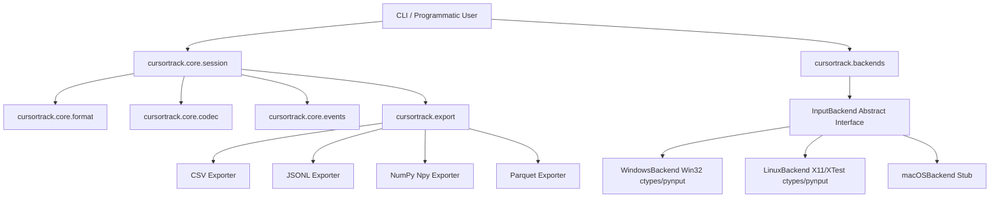

# Architecture and Design

This document details the modular system architecture of CursorTrack and its boundaries.

---

## 1. System Block Diagram

---

## 2. Package Boundaries

### `cursortrack/cli/`
The command-line parsing layer. It uses **Typer** and **Rich** to provide user interaction, terminal formatting, status updates, and progress bars. The CLI files are thin wrappers calling underlying library logic in `core/` and `export/`.

### `cursortrack/core/`
The programmatic core library.
- [format.py](../cursortrack/core/format.py) handles packing and unpacking file headers.
- [codec.py](../cursortrack/core/codec.py) manages raw integer encodings (varint/zigzag) and streaming compression writers.
- [events.py](../cursortrack/core/events.py) defines the structured dataclass hierarchy for input events (`MoveEvent`, `ButtonEvent`, etc.) and handles tag serialization.
- [session.py](../cursortrack/core/session.py) exposes the primary developer API `Session` for programmatically loading, editing, saving, and analyzing tracks (e.g. converting to Pandas DataFrames).

### `cursortrack/backends/`
Encapsulates OS-specific interaction. Subclasses of `InputBackend` implement coordinates retrieval, mouse warping, and hardware click/scroll hooks. Calling code handles these actions through the abstraction, making platform support entirely additive.

### `cursortrack/export/`
Translates parsed `Session` events into analytical standard formats. It handles CSV, JSON Lines, NumPy binary files, and optionally Parquet tables.

---

## 3. Playback Fail-Safe Architecture

To prevent simulated replays from capturing display focus and locking out human control, CursorTrack intercepts physical movement:
- During playback, before setting each virtual cursor position, the script queries the physical hardware cursor position using `backend.read_position()`.
- If the current cursor coordinate deviates from the expected coordinates and sits within 5 pixels of any monitor screen corner, a fail-safe trigger aborts execution immediately.

---

## 4. Touch and Gesture Boundary

Current backends expose cursor movement, mouse buttons, and wheel-style scroll
events only. They do not emit raw touch contacts, pressure, finger IDs, or
multi-finger gesture phases. Consequently:

- `cursortrack record --capture touch` is rejected rather than misrepresenting
  ordinary mouse clicks as `TapEvent` records.
- `--capture all` means all currently supported mouse events: move, click, and
  scroll.
- The v2 `CAP_TOUCH` bit and `TapEvent` tag remain decodable for file-format
  compatibility and possible future native backends. Playback of an existing
  tap retains its legacy left-click interpretation.

Two-finger touchpad scrolling is captured only when the OS or device driver
synthesizes a standard wheel event. Windows Precision Touchpad drivers may use
`WM_POINTER`/DirectManipulation instead of `WM_MOUSEWHEEL`; macOS may report
smooth or inertial deltas that cannot be represented faithfully as integer
wheel steps; native Wayland deliberately restricts global observation.
Physical mouse wheels remain within the supported path.

Real touch capture would require separate platform implementations and a richer
event model: Windows Raw Input/HID parsing, macOS digitizer/event-tap semantics,
and compositor-approved Wayland APIs. It must not be approximated from mouse
click callbacks.

---

## 5. Linux (X11/Wayland) Notes

`LinuxBackend` mirrors the Windows backend's dependency-free design: it drives the X server directly through `ctypes` against `libX11`/`libXtst` (no Python packages needed for playback or position sampling), and reuses `pynput` for global click/scroll capture hooks.

**How each operation maps to X11:**
- `read_position()` → `XQueryPointer` on the root window.
- `set_position(x, y)` → `XWarpPointer` to root-window coordinates.
- `get_screen_size()` → `XDisplayWidth`/`XDisplayHeight` of the default screen.
- `click(button, pressed)` → `XTestFakeButtonEvent` (X buttons 1/2/3 for left/middle/right, 8/9 for x1/x2).
- `scroll(sdx, sdy)` → the X11 core protocol has no scroll-delta events; each wheel step is a press+release of buttons 4-7 (up/down/left/right).

**Why every injection is followed by `XSync`, not `XFlush`.** Xlib buffers protocol requests per connection. Flushing the buffer alone was observed (under Xvfb, with a `pynput` hook listening on a second connection) to leave `XTestFakeButtonEvent` requests undelivered to other clients' event hooks, while a full server round-trip (`XSync`) delivers them reliably. `pynput`'s own Linux controller syncs after every injection for the same reason. The cost is one round-trip per injected event, which is negligible against the recorder's sampling intervals.

**Threading.** `XInitThreads` is called before any other Xlib call so a single backend's display connection is safe to touch from both the recorder's sampling loop and the playback fail-safe polling.

**Wayland scope.** On Wayland desktops, CursorTrack connects to the XWayland compatibility server. Position reads, warps, and injected clicks work within the XWayland coordinate space, and capture hooks see events routed to X11 clients. What is *not* possible — for any unprivileged process, by compositor design — is globally capturing input delivered to native Wayland clients or injecting input into them. First-class native Wayland support would require the `org.freedesktop.portal.RemoteDesktop` portal (interactive permission prompts) or raw `/dev/input` access (root/`input` group); both are tracked in [ROADMAP.md](../ROADMAP.md).
