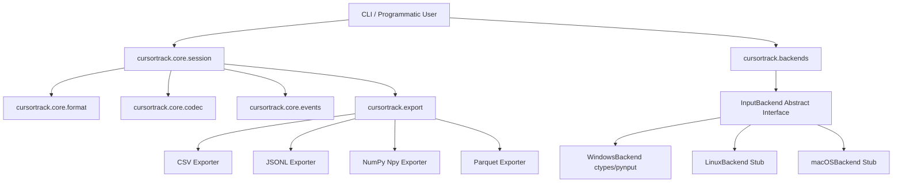

# Architecture and Design

This document details the modular system architecture of CursorTrack and its boundaries.

---

## 1. System Block Diagram

---

## 2. Package Boundaries

### `cursortrack/cli/`
The command-line parsing layer. It uses **Typer** and **Rich** to provide user interaction, terminal formatting, status updates, and progress bars. The CLI files are thin wrappers calling underlying library logic in `core/` and `export/`.

### `cursortrack/core/`
The programmatic core library.
- [format.py](../cursortrack/core/format.py) handles packing and unpacking file headers.
- [codec.py](../cursortrack/core/codec.py) manages raw integer encodings (varint/zigzag) and streaming compression writers.
- [events.py](../cursortrack/core/events.py) defines the structured dataclass hierarchy for input events (`MoveEvent`, `ButtonEvent`, etc.) and handles tag serialization.
- [session.py](../cursortrack/core/session.py) exposes the primary developer API `Session` for programmatically loading, editing, saving, and analyzing tracks (e.g. converting to Pandas DataFrames).

### `cursortrack/backends/`
Encapsulates OS-specific interaction. Subclasses of `InputBackend` implement coordinates retrieval, mouse warping, and hardware click/scroll hooks. Calling code handles these actions through the abstraction, making platform support entirely additive.

### `cursortrack/export/`
Translates parsed `Session` events into analytical standard formats. It handles CSV, JSON Lines, NumPy binary files, and optionally Parquet tables.

---

## 3. Playback Fail-Safe Architecture

To prevent simulated replays from capturing display focus and locking out human control, CursorTrack intercepts physical movement:
- During playback, before setting each virtual cursor position, the script queries the physical hardware cursor position using `backend.read_position()`.
- If the current cursor coordinate deviates from the expected coordinates and sits within 5 pixels of any monitor screen corner, a fail-safe trigger aborts execution immediately.
